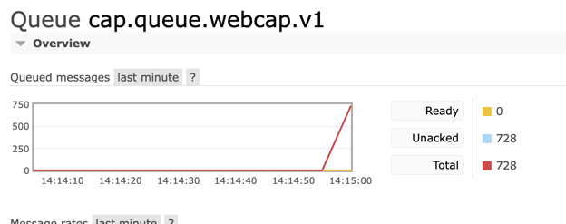

# Test Cap

1 - `docker compose up -d rabbitmq`

Open `http://localhost:15672/#/queues/%2F/cap.queue.webcap.v1` and see a Not found page.

2 - `docker compose up -d app`

Refresh previews URL and now you can see the queue.

3 - `docker compose up -d load-data`

Now you can see all messages in Unacked state:

